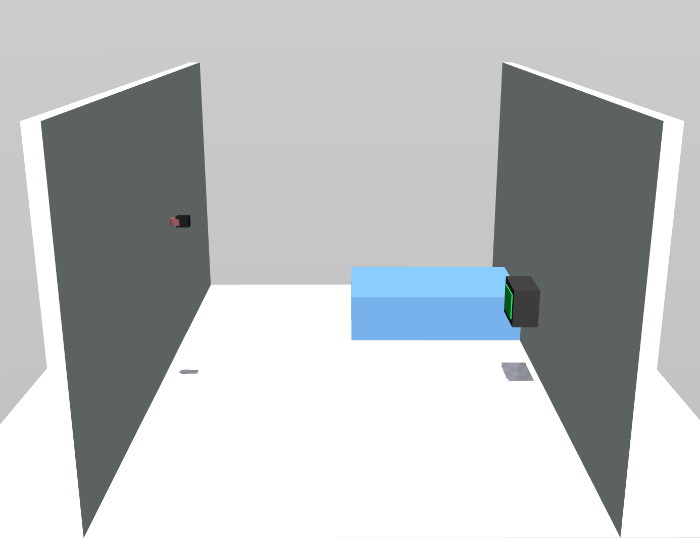
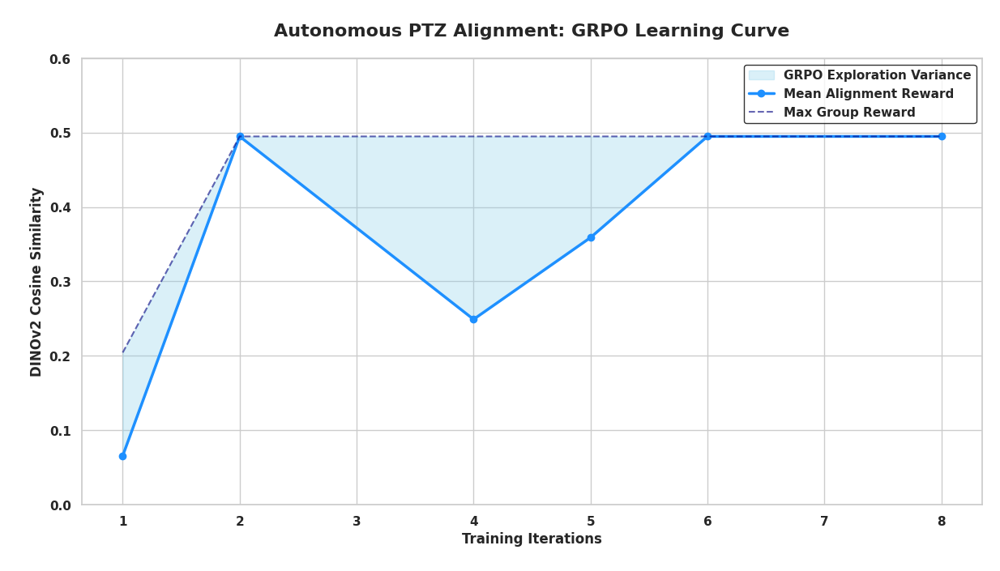
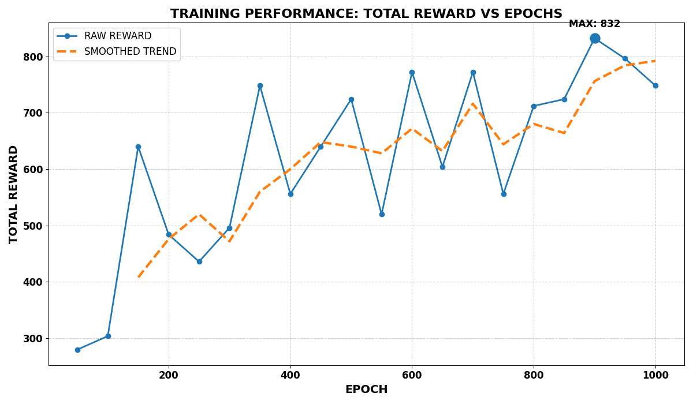

# 🎯 Autonomous PTZ Camera Alignment via GRPO  
### Submission for the Meta PyTorch OpenEnv Hackathon 2026  

**Team fp16:** [**Anubhav Tripathi**](https://splendid-tiramisu-56ef8e.netlify.app/), **Janaksinh Ven** 

---

## 📖 1. The Challenge: Overcoming Hardware Drift  

In critical environments like hospital ICUs, PTZ (Pan-Tilt-Zoom) cameras are the primary eyes for monitoring patient vitals. However, **"Hardware Drift"** caused by mechanical wear, motor jitter, or manual interference often leads to misalignment.

### 💡 The Solution: Embodied AI
We treat camera alignment not as a static image matching problem, but as an **embodied AI challenge**. We developed a **Virtual Operator** using a Small Language Model (SLM) trained via **Group Relative Policy Optimization (GRPO)** to reason over visual deltas and execute precise motor corrections.

---

## 🖼️ 2. Visual Environment & Perception

### 🖥️ Simulation Environment
We utilize a high-fidelity **MuJoCo** simulation to model the PTZ camera's physical constraints and environmental dynamics.


*Image 1: MuJoCo environment showing the room and PTZ camera setup.*

### 👁️ The "Eyes" (DINOv2)
The model perceives the world through a frozen **DINOv2 (ViT-S/14)** encoder. It compares the current "drifted" view against the "reference" preset to generate a 384-dimensional spatial embedding.


*Image 2: Camera view showing the vitals monitor and target alignment.*

---


## 🏗️ 3. System Architecture

Training an LLM for continuous physical control requires decoupling perception from policy.

### 🔁 The Dual-Agent Pipeline
| Component | Model | Role |
| :--- | :--- | :--- |
| **Perception** | **DINOv2** | Extracts spatial `v_delta` vectors & computes cosine similarity. |
| **Projector** | **MLP Adapter** | Maps visual features into "soft prompt" virtual tokens. |
| **Policy** | **Qwen 2.5 3B** | Reasons over visual cues to output JSON motor commands. |

---
## 🧪 4. Training & Optimization Strategy

We employ a dual-monitoring strategy to track both the "intelligence" of the model's reasoning and its actual physical performance in the MuJoCo environment.

### 🧠 A. Policy Learning (GRPO Dynamics)
We monitor how the **Qwen 2.5 3B** backbone learns to differentiate between "good" and "bad" motor trajectories within a single sampled group.


*Image 3: **Policy Exploration Space.** The shaded region represents the variance within GRPO groups. The convergence of the mean and max lines indicates that the LLM is successfully narrowing down its reasoning to the most optimal alignment actions.*

**Key Observations:**
- **Exploration Efficiency:** In early steps, the wide variance shows the model actively exploring the PTZ coordinate space.
- **Rapid Convergence:** By Step 2, the model successfully identified the target alignment cues, surging from a 0.06 to 0.49 similarity score.
- **Policy Saturation:** The convergence of Mean and Max rewards demonstrates a stable policy that has "locked onto" the reference preset.

### 📈 B. Reinforcement Learning Performance
While the policy learns to "think," we track the absolute alignment accuracy (DINOv2 Cosine Similarity) to ensure physical convergence and precision.


*Image 4: **Reward Signal Convergence.** This plot tracks the raw alignment score over time. The upward trend validates that our "Virtual Operator" is successfully reducing camera drift across multiple episodes through continuous motor corrections.*

**Technical Details:**
* **Reward Signal:** A weighted combination of **Cosine Similarity** (visual alignment) and **Action Penalties** (to ensure smooth, energy-efficient motion).
* **Optimization:** Leveraging group-relative advantages to stabilize the policy without the overhead of a dedicated critic network.
* **Safety Rate:** Designed for high-precision alignment with minimal iteration cycles.

---

## 🚀 5. Execution & Results (WIP)

### 🛠️ Technical Stack
* **Framework:** PyTorch, Hugging Face Transformers
* **Optimization:** GRPO (Group Relative Policy Optimization)
* **Simulation:** MuJoCo / HackathonICUEnv
* **Tracking:** Weights & Biases (W&B)

### 📈 Current Training Output
> *Note: Sample log from `train_llm.py` execution showing valid JSON generation.*

```text
step=00120 loss=0.01420 reward_mean=0.82500 reward_max=0.91200
valid_action_rate=1.00
example action text: {"pan_delta": 0.042, "tilt_delta": -0.015}
Status: Converging...
```

## 🔮 Future Research Directions
- **Quantized VLA:** Investigating 4-bit (bitsandbytes) quantization to run 7B-parameter models on edge-devices (NVIDIA Jetson) for real-time ICU deployments.
- **Multimodal State Integration:** Incorporating depth-maps and audio-cues to handle dynamic occlusions (e.g., medical staff walking in front of the camera).
- **Safety-Constrained RL:** Implementing Control Barrier Functions (CBF) within the GRPO loop to ensure motor movements never exceed physical structural limits.


